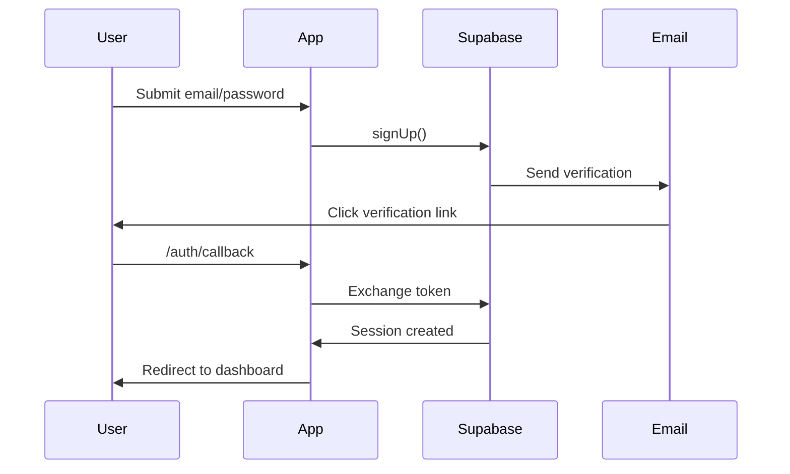

## Authentication

KwikSaaS uses Supabase Auth for secure, session-based authentication. This guide covers setup, configuration, and customization of all auth flows.

<Info>
  Auth is pre-configured out of the box. This guide helps you understand and
  customize the implementation.
</Info>

### What's Included

- **Email/password** — Sign up with email verification, sign in, and password management
- **OAuth providers** — Pre-configured Google and GitHub sign-in
- **Magic links** — Passwordless authentication via email
- **Password reset** — Secure reset flow with email confirmation
- **Protected routes** — Middleware-based route protection
- **Session management** — Server and client-side session handling

---

## Prerequisites

Before configuring auth, ensure you have:

<Steps>
<Step title="Supabase project">
Create a project at [supabase.com](https://supabase.com). You'll need the project URL and anon key.
</Step>
<Step title="Environment variables">
Copy `.env.example` to `.env.local` and fill in:

```bash
NEXT_PUBLIC_SUPABASE_URL=https://your-project.supabase.co
NEXT_PUBLIC_SUPABASE_PUBLISHABLE_KEY=eyJ...
SUPABASE_SECRET_KEY=eyJ...
```

</Step>
</Steps>

---

## Configure Supabase URLs

<Warning>
  This step is critical. Auth flows will fail without correct URL configuration.
</Warning>

Go to **Supabase Dashboard → Authentication → URL Configuration**:

| Setting       | Value                                                            |
| ------------- | ---------------------------------------------------------------- |
| Site URL      | `http://localhost:3000` (dev) or `https://yourdomain.com` (prod) |
| Redirect URLs | `http://localhost:3000/auth/callback`                            |

For production, add all domains:

```
https://yourdomain.com/auth/callback
https://www.yourdomain.com/auth/callback
```

---

## OAuth Providers

### Google OAuth

<Steps>
<Step title="Create OAuth credentials">
1. Go to [Google Cloud Console](https://console.cloud.google.com/)
2. Create a new project or select existing
3. Navigate to **APIs & Services → Credentials**
4. Click **Create Credentials → OAuth client ID**
5. Select **Web application**
6. Add authorized redirect URI from Supabase (found in provider settings)
</Step>

<Step title="Enable in Supabase">
1. Go to **Authentication → Providers → Google**
2. Enable the provider
3. Enter Client ID and Client Secret from Google
4. Save changes
</Step>
</Steps>

### GitHub OAuth

<Steps>
<Step title="Create OAuth App">
1. Go to **GitHub Settings → Developer settings → OAuth Apps**
2. Click **New OAuth App**
3. Set Homepage URL to your site
4. Set Authorization callback URL from Supabase
</Step>

<Step title="Enable in Supabase">
1. Go to **Authentication → Providers → GitHub**
2. Enable and enter Client ID and Client Secret
3. Save changes
</Step>
</Steps>

<Check>
  Test OAuth by clicking the Google/GitHub buttons on `/sign-in`. You should be
  redirected to the provider and back to your dashboard.
</Check>

---

## Auth Flows

### Sign Up Flow



### Magic Link Flow

1. User enters email on `/sign-in`
2. Server action calls `supabase.auth.signInWithOtp()`
3. User receives email with magic link
4. Click redirects to `/auth/callback`
5. Session is created and user lands on dashboard

### Password Reset Flow

1. User clicks "Forgot password" → `/forgot-password`
2. Enter email, server action sends reset email
3. Email contains link to `/reset-password?code=...`
4. `/auth/callback` sets recovery cookie and redirects
5. User enters new password on `/reset-password`

---

## File Structure

```
src/app/(auth)/
├── actions.ts              # Server actions for all auth operations
├── layout.tsx              # Auth layout wrapper
├── sign-in/page.tsx        # Sign in form
├── sign-up/page.tsx        # Sign up form
├── forgot-password/page.tsx # Request password reset
└── reset-password/page.tsx  # Set new password

src/app/auth/
└── callback/route.ts       # Handles all auth redirects

src/components/auth/
├── auth-page-layout.tsx    # Consistent auth page styling
├── oauth-buttons.tsx       # Google/GitHub sign-in buttons
└── update-password-form.tsx # Password reset form

src/lib/supabase/
├── client.ts               # Browser client
├── server.ts               # Server component client
├── admin.ts                # Admin client (service role)
└── middleware.ts           # Session refresh middleware
```

---

## Protected Routes

Middleware in `src/lib/supabase/middleware.ts` handles route protection:

- **Unauthenticated users** → Redirected away from `/dashboard/*`
- **Authenticated users** → Redirected away from `/sign-in`, `/sign-up`, `/forgot-password` (unless in recovery mode)

### Adding New Protected Routes

To protect additional routes, update the middleware patterns:

```typescript
// In middleware.ts
const protectedPaths = ["/dashboard", "/settings", "/your-new-route"];
```

---

## Auth Context

Access user state anywhere in your app:

```tsx
import { useAuth } from "@/components/auth/auth-context";

function MyComponent() {
  const { user, session, loading, signOut } = useAuth();

  if (loading) return <Spinner />;
  if (!user) return <SignInPrompt />;

  return <div>Welcome, {user.email}</div>;
}
```

The `AuthProvider` wraps the app in `layout.tsx` and:

- Listens to Supabase auth state changes
- Identifies users in PostHog (if configured)
- Provides `signOut` helper

---

## Server Actions

All auth operations use server actions in `src/app/(auth)/actions.ts`:

| Action                   | Purpose                |
| ------------------------ | ---------------------- |
| `signIn`                 | Email/password sign in |
| `signUp`                 | Create new account     |
| `signInWithMagicLink`    | Send magic link email  |
| `signInWithOAuth`        | Initiate OAuth flow    |
| `sendPasswordResetEmail` | Request password reset |
| `resetPassword`          | Set new password       |
| `signOut`                | End session            |

All actions are rate-limited and return sanitized errors.

---

## Email Templates

Auth emails are sent via Resend (if configured) or Supabase's default SMTP.

### Configure Resend (Recommended)

<Steps>
<Step title="Set environment variables">
```bash
RESEND_API_KEY=re_...
RESEND_FROM_EMAIL=auth@yourdomain.com
RESEND_LOGO_URL=https://yourdomain.com/logo.png
```
</Step>

<Step title="Verify your domain">
  Add SPF, DKIM, and DMARC records in your DNS provider as shown in Resend
  dashboard.
</Step>

<Step title="Connect to Supabase">
Go to **Supabase → Authentication → Email Templates → SMTP Settings** and enter Resend SMTP credentials.
</Step>
</Steps>

### Email Template Files

Custom React Email templates are in `src/components/emails/`:

- `MagicLinkEmail.tsx`
- `ConfirmEmailTemplate.tsx`
- `ResetPasswordEmail.tsx`

---

## Troubleshooting

<AccordionGroup>
<Accordion title="OAuth redirect fails">
**Check Supabase URL Configuration:**
- Site URL must match your app URL exactly
- Redirect URLs must include `/auth/callback`
- For local dev, use `http://localhost:3000`, not `127.0.0.1`

**Verify OAuth credentials:**

- Client ID and Secret are correct
- Redirect URI in provider console matches Supabase
</Accordion>

<Accordion title="Email verification not arriving">
  **Check:** 1. Spam/junk folder 2. Supabase rate limits (4 emails/hour on free
  tier) 3. Email templates are enabled in Supabase dashboard 4. If using Resend,
  verify domain is confirmed
</Accordion>

<Accordion title="Session not persisting">
  **Possible causes:** - Cookies blocked by browser - `NEXT_PUBLIC_SITE_URL`
  doesn't match actual URL - Middleware not running (check `middleware.ts`
  matcher)
</Accordion>

<Accordion title="Reset password shows error">
**Recovery flow requires:**
1. Valid reset link (not expired)
2. Recovery cookie set by `/auth/callback`
3. Correct `type=recovery` in callback URL
</Accordion>
</AccordionGroup>

---

## Next Steps

<CardGroup cols={2}>
  <Card title="Payments" icon="credit-card" href="/payments">
    Add Stripe billing after auth is working
  </Card>
  <Card title="Dashboard" icon="gauge" href="/components">
    Customize the protected dashboard pages
  </Card>
</CardGroup>
