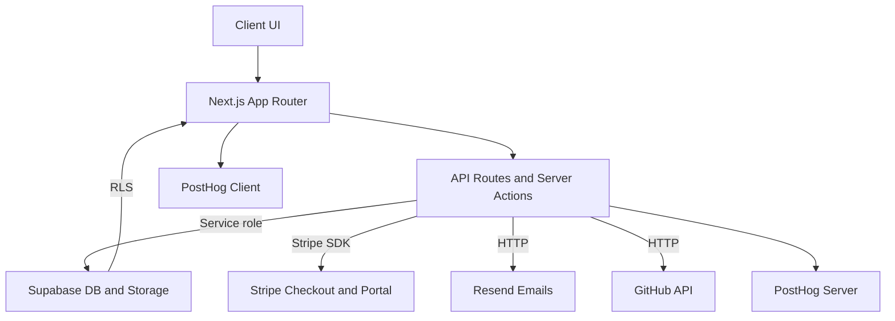

## Welcome to KwikSaaS

Launch your SaaS product in days, not months. KwikSaaS is a complete, production-ready boilerplate with authentication, billing, email, analytics, and a polished UI out of the box.

<CardGroup cols={2}>
  <Card title="Quickstart" icon="rocket" href="/quickstart">
    Get running locally in under 10 minutes
  </Card>
  <Card title="Authentication" icon="lock" href="/authentication">
    Supabase Auth with OAuth, magic links, and more
  </Card>
  <Card title="Payments" icon="credit-card" href="/payments">
    Stripe checkout, subscriptions, and customer portal
  </Card>
  <Card title="Customization" icon="palette" href="/customization">
    Brand with your logo, colors, and content
  </Card>
</CardGroup>

---

## What's Included

<AccordionGroup>
<Accordion title="Authentication" icon="lock">
Complete auth system with Supabase:
- Email/password with verification
- OAuth providers (Google, GitHub)
- Magic links for passwordless login
- Password reset flow
- Protected routes via middleware
- Session management (server + client)
</Accordion>

<Accordion title="Payments" icon="credit-card">
  Stripe integration for billing: - Checkout sessions for subscriptions and
  one-time purchases - Customer Portal for self-service management - Webhook
  handlers for automatic database sync - Plan-based feature gating - Promo codes
  and coupons support
</Accordion>

<Accordion title="Email" icon="envelope">
  Transactional emails with Resend: - Magic link emails - Email confirmation -
  Password reset - Purchase receipts - React Email templates for customization
</Accordion>

<Accordion title="Dashboard" icon="gauge">
  Production-ready dashboard: - Collapsible sidebar navigation - Settings pages
  (general, account, billing, notifications) - Interactive charts (Recharts) -
  Data tables with sorting and filtering - User menu with profile and sign-out
</Accordion>

<Accordion title="Marketing" icon="bullhorn">
  Conversion-optimized landing pages: - Hero section with CTAs - Features
  showcase (grid, bento, accordion) - Social proof marquee - Pricing page with
  plan comparison - FAQ accordion - Contact form with validation
</Accordion>

<Accordion title="Content" icon="file-lines">
  MDX-powered content: - Blog with tags, authors, and thumbnails - Changelog for
  version updates - Legal pages (privacy, terms, cookies) - Syntax highlighting
  with Shiki - Dynamic OG image generation
</Accordion>

<Accordion title="Analytics" icon="chart-line">
  PostHog integration (optional): - Automatic pageview tracking - Custom event
  capture (client + server) - User identification - Feature flags and A/B
  testing - Session replay support
</Accordion>

<Accordion title="SEO" icon="magnifying-glass">
Built-in SEO best practices:
- Dynamic sitemap generation
- robots.txt configuration
- Metadata API for all pages
- Open Graph images
- JSON-LD structured data
</Accordion>
</AccordionGroup>

---

## Tech Stack

| Layer      | Technology                         |
| ---------- | ---------------------------------- |
| Framework  | Next.js 16 (App Router, React 19)  |
| Language   | TypeScript, Tailwind CSS v4        |
| Database   | Supabase (Postgres, Auth, Storage) |
| Payments   | Stripe                             |
| Email      | Resend + React Email               |
| Analytics  | PostHog (optional)                 |
| Validation | Zod + React Hook Form              |
| UI         | 50+ shadcn/radix components        |

---

## Architecture Overview

### How It Works

1. **Marketing → Checkout**: Pricing buttons call `/api/checkout_sessions` → Stripe collects payment → webhooks sync to Supabase
2. **Access Control**: `lib/access.ts` checks subscriptions and one-time purchases
3. **Dashboard**: Server actions read RLS-protected data; middleware protects routes
4. **Email**: Auth emails via Resend with React Email templates
5. **SEO**: Centralized config powers metadata, sitemaps, and OG images

---

## Quick Facts

- **Framework**: Next.js 16 with Turbopack
- **React**: Version 19 with Server Components
- **Styling**: Tailwind CSS v4
- **Package Manager**: npm or pnpm
- **Minimum Node**: 18+

---

## Getting Help

<CardGroup cols={2}>
  <Card
    title="GitHub Issues"
    icon="github"
    href="https://github.com/MohammedAlhawamdeh/kwiksaas/issues"
  >
    Report bugs or request features
  </Card>
  <Card
    title="Email Support"
    icon="envelope"
    href="mailto:support@kwiksaasapp.com"
  >
    Direct support for customers
  </Card>
</CardGroup>

---

## Next Steps

<Steps>
  <Step title="Clone and install">
    Follow the [Quickstart](/quickstart) to get running locally.
  </Step>
  <Step title="Configure services">
    Set up Supabase, Stripe, and Resend with your API keys.
  </Step>
  <Step title="Customize branding">
    Update logo, colors, and content in the [Customization](/customization)
    guide.
  </Step>
  <Step title="Deploy">
    Push to production with [Deployment](/deployment) instructions.
  </Step>
</Steps>
