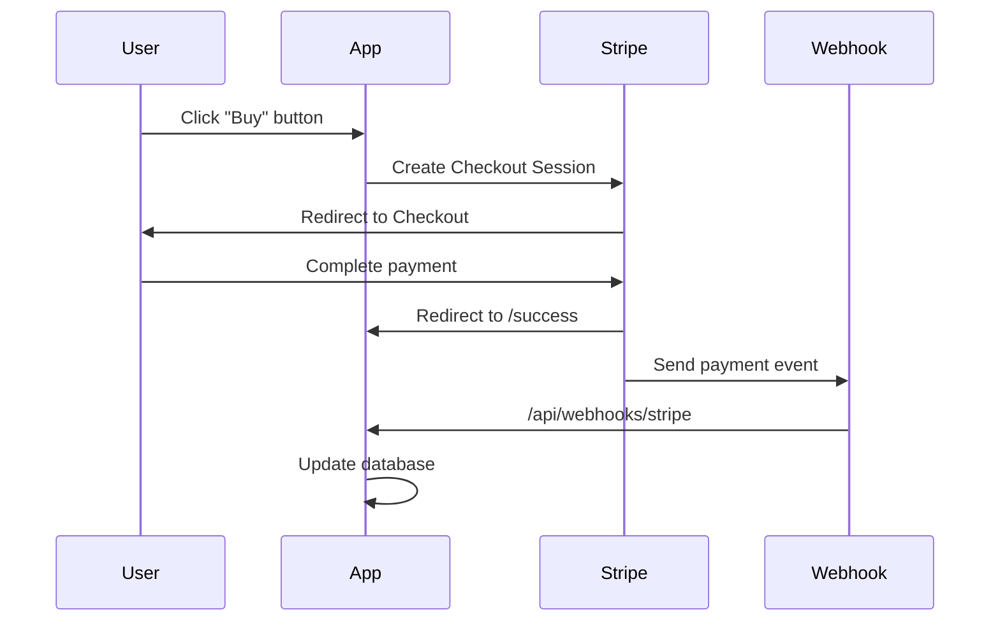

## Payments

KwikSaaS uses Stripe for all payment processing. This guide covers setup, configuration, and testing.

<Info>
  Payments are pre-configured. This guide helps you customize plans and connect
  your Stripe account.
</Info>

---

## What's Included

- **Stripe Checkout** — Hosted payment page for secure transactions
- **Customer Portal** — Self-service subscription management
- **Webhook sync** — Automatic database updates on payment events
- **Plan gating** — Feature access based on subscription status
- **Multiple pricing** — Subscriptions (monthly/yearly) and lifetime one-time purchases

---

## Payment Flow



---

## Prerequisites

<CardGroup cols={2}>
  <Card title="Stripe Account" icon="stripe">
    Create at [stripe.com](https://stripe.com). Use test mode for development.
  </Card>
  <Card title="Supabase Database" icon="database">
    Migrations applied with billing tables.
  </Card>
</CardGroup>

---

## Stripe Setup

<Steps>
<Step title="Get API keys">
Go to [Stripe Dashboard → Developers → API keys](https://dashboard.stripe.com/apikeys):

| Key             | Environment Variable                 | Usage                        |
| --------------- | ------------------------------------ | ---------------------------- |
| Publishable key | `NEXT_PUBLIC_STRIPE_PUBLISHABLE_KEY` | Client-side (safe to expose) |
| Secret key      | `STRIPE_SECRET_KEY`                  | Server-side (keep secret)    |

<Warning>
Use **test mode** keys during development. Toggle "Test mode" in the Stripe Dashboard header.
</Warning>
</Step>

<Step title="Create products">
Go to **Products** in Stripe Dashboard:

1. Click **Add product**
2. Set name (e.g., "KwikSaaS Standard")
3. Add description
4. Set pricing:
   - **One-time** for lifetime access
   - **Recurring** for subscriptions
5. Save and copy the **Price ID** (starts with `price_`)
</Step>

<Step title="Add price IDs to environment">
```bash
# .env.local
NEXT_PUBLIC_STRIPE_PRICE_ID_STANDARD_LIFETIME=price_...
NEXT_PUBLIC_STRIPE_PRICE_ID_ULTIMATE_LIFETIME=price_...

# For subscriptions (optional)

NEXT*PUBLIC_STRIPE_PRICE_ID_PRO_MONTHLY=price*...
NEXT*PUBLIC_STRIPE_PRICE_ID_PRO_YEARLY=price*...

````
</Step>

<Step title="Set up webhooks">
**For local development:**
```bash
# Install Stripe CLI
brew install stripe/stripe-cli/stripe

# Login
stripe login

# Forward webhooks
stripe listen --forward-to localhost:3000/api/webhooks/stripe
````

Copy the webhook signing secret (`whsec_...`) to:

```bash
STRIPE_WEBHOOK_SECRET=whsec_...
```

**For production:**

1. Go to **Developers → Webhooks** in Stripe Dashboard
2. Add endpoint: `https://yourdomain.com/api/webhooks/stripe`
3. Select events:
   - `checkout.session.completed`
   - `customer.subscription.created`
   - `customer.subscription.updated`
   - `customer.subscription.deleted`
   - `invoice.payment_succeeded`
   - `invoice.payment_failed`
   - `payment_intent.succeeded`
4. Copy the signing secret to production environment
</Step>
</Steps>

---

## Plan Configuration

Plans are defined in `src/lib/payments/plans.ts`:

```typescript
export const plans: Plan[] = [
  {
    id: "free",
    name: "Free",
    description: "Get started with the basics",
    monthlyPrice: 0,
    yearlyPrice: 0,
    stripePriceIds: { monthly: null, yearly: null },
    features: ["Starter features", "Community support"],
    featureAccess: ["basic"],
    isPopular: false,
    buttonText: "Get started",
    isFree: true,
  },
  {
    id: "standard",
    name: "Standard",
    description: "Lifetime access to core features",
    monthlyPrice: 39,
    yearlyPrice: null,
    stripePriceIds: {
      monthly: process.env.NEXT_PUBLIC_STRIPE_PRICE_ID_STANDARD_LIFETIME,
      yearly: null,
    },
    features: [
      "Lifetime access",
      "Core SaaS boilerplate",
      "Email & Auth setup",
    ],
    featureAccess: ["basic", "templates", "support"],
    isPopular: false,
    buttonText: "Get Standard",
    allowPromotionCodes: true,
  },
  {
    id: "ultimate",
    name: "Ultimate",
    description: "Everything plus GitHub access",
    monthlyPrice: 69,
    yearlyPrice: null,
    stripePriceIds: {
      monthly: process.env.NEXT_PUBLIC_STRIPE_PRICE_ID_ULTIMATE_LIFETIME,
      yearly: null,
    },
    features: [
      "Everything in Standard",
      "GitHub repo access",
      "Future updates",
    ],
    featureAccess: ["basic", "templates", "support", "api", "advanced"],
    isPopular: true,
    buttonText: "Get Ultimate",
    allowPromotionCodes: true,
  },
];
```

### Plan Properties

| Property              | Description                          |
| --------------------- | ------------------------------------ |
| `id`                  | Unique identifier (used in database) |
| `name`                | Display name                         |
| `monthlyPrice`        | Price shown on pricing page          |
| `stripePriceIds`      | Stripe Price IDs for checkout        |
| `features`            | Display features (marketing)         |
| `featureAccess`       | Feature keys for access control      |
| `allowPromotionCodes` | Enable promo codes in checkout       |

---

## API Endpoints

### Create Checkout Session

**POST `/api/checkout_sessions`**

```bash
curl -X POST https://yourdomain.com/api/checkout_sessions \
  -H "Content-Type: application/json" \
  -d '{"priceId": "price_..."}'
```

**Response:**

```json
{ "url": "https://checkout.stripe.com/c/pay/cs_..." }
```

### Customer Portal

**POST `/api/customer_portal`**

Opens Stripe's billing portal for subscription management.

```typescript
// Client-side usage
const response = await fetch("/api/customer_portal", {
  method: "POST",
  headers: { "Content-Type": "application/json" },
  body: JSON.stringify({ return_url: "/dashboard" }),
});
const { url } = await response.json();
window.location.href = url;
```

### Webhooks

**POST `/api/webhooks/stripe`**

Handles Stripe events and updates database:

| Event                           | Action                                   |
| ------------------------------- | ---------------------------------------- |
| `checkout.session.completed`    | Create subscription or one-time purchase |
| `customer.subscription.created` | Insert subscription record               |
| `customer.subscription.updated` | Update status, period dates              |
| `customer.subscription.deleted` | Mark as canceled                         |
| `invoice.payment_succeeded`     | Log payment history                      |
| `invoice.payment_failed`        | Log failure, update status               |
| `payment_intent.succeeded`      | Record one-time purchase                 |

---

## Database Tables

### `user_subscriptions`

Stores active subscription state:

| Column                   | Description                                  |
| ------------------------ | -------------------------------------------- |
| `user_id`                | Supabase Auth user ID                        |
| `stripe_customer_id`     | Stripe Customer ID                           |
| `stripe_subscription_id` | Stripe Subscription ID                       |
| `stripe_price_id`        | Current price ID                             |
| `status`                 | `active`, `trialing`, `canceled`, `past_due` |
| `billing_cycle`          | `monthly` or `yearly`                        |
| `current_period_end`     | When current period ends                     |
| `cancel_at_period_end`   | If scheduled for cancellation                |

### `one_time_purchases`

Stores lifetime/one-time purchases:

| Column                     | Description              |
| -------------------------- | ------------------------ |
| `user_id`                  | Supabase Auth user ID    |
| `stripe_payment_intent_id` | Stripe Payment Intent ID |
| `status`                   | `succeeded`, `failed`    |
| `granted_at`               | When access was granted  |
| `revoked_at`               | If access was revoked    |

### `payment_history`

Audit log of all payments:

| Column         | Description               |
| -------------- | ------------------------- |
| `user_id`      | Supabase Auth user ID     |
| `amount`       | Payment amount (cents)    |
| `currency`     | Currency code             |
| `payment_type` | `recurring` or `one_time` |
| `invoice_url`  | Link to Stripe invoice    |

---

## Access Control

Check user access with helpers in `src/lib/access.ts`:

```typescript
import { hasAccess, canAccessFeature, requireFeature } from "@/lib/access";

// Check if user has any paid access
const hasPaidAccess = await hasAccess(userId);

// Check specific feature
const canUseApi = await canAccessFeature(userId, "api");

// Throw error if no access (for protected routes)
await requireFeature(userId, "advanced");
```

### Feature Keys

| Key             | Description                  |
| --------------- | ---------------------------- |
| `basic`         | Basic app access (all plans) |
| `templates`     | Template library             |
| `support`       | Priority support             |
| `api`           | API access                   |
| `analytics`     | Advanced analytics           |
| `custom_domain` | Custom domain support        |
| `advanced`      | Subscriber-only features     |

---

## Testing

### Test Cards

Use these card numbers in Stripe test mode:

| Scenario           | Card Number           |
| ------------------ | --------------------- |
| Successful payment | `4242 4242 4242 4242` |
| Declined card      | `4000 0000 0000 0002` |
| Requires 3D Secure | `4000 0027 6000 3184` |
| Insufficient funds | `4000 0000 0000 9995` |

Use any future expiry date and any 3-digit CVC.

### Testing Webhooks Locally

1. Start your dev server: `npm run dev`
2. Start Stripe listener:
   ```bash
   stripe listen --forward-to localhost:3000/api/webhooks/stripe
   ```
3. Complete a test checkout
4. Check database for new records

### Verify Webhook Events

```bash
# Trigger a test event
stripe trigger checkout.session.completed
```

---

## Promo Codes & Coupons

### Create in Stripe

1. Go to **Products → Coupons** in Stripe Dashboard
2. Create coupon with:
   - Percentage or fixed amount off
   - Duration (once, repeating, forever)
   - Redemption limits

### Enable in Plans

```typescript
{
  id: "standard",
  // ...
  allowPromotionCodes: true, // Enable promo codes in checkout
}
```

---

## Troubleshooting

<AccordionGroup>
<Accordion title="Checkout returns 400 error">
**Check:**
- Price ID is correct and matches Stripe
- Plan exists in `plans.ts` with matching price ID
- Stripe is in correct mode (test vs live)
</Accordion>

<Accordion title="Webhook signature verification failed">
  **Check:** - `STRIPE_WEBHOOK_SECRET` matches the endpoint - For local: restart
  `stripe listen` and update secret - For production: verify webhook URL is
  correct
</Accordion>

<Accordion title="Subscription not appearing in database">
  **Check:** 1. Webhook listener is running 2. Check Stripe Dashboard →
  Developers → Webhooks for failures 3. Verify database migrations have been
  applied 4. Check server logs for errors
</Accordion>

<Accordion title="Customer portal not working">
**Check:**
- User has a `stripe_customer_id` in `user_subscriptions`
- User is authenticated
- Portal is enabled in Stripe Dashboard settings
</Accordion>
</AccordionGroup>

---

## Going to Production

<Steps>
<Step title="Switch to live mode">
Replace test API keys with live keys in production environment.
</Step>

<Step title="Create production products">
  Create new products in live mode (test products don't transfer).
</Step>

<Step title="Add production webhook">
  Add endpoint in Stripe Dashboard pointing to production URL.
</Step>

<Step title="Update price IDs">
  Set production price IDs in environment variables.
</Step>

<Step title="Test with real card">
Do a small real transaction to verify the flow.
</Step>
</Steps>

<Warning>
  Keep test and production environments completely separate. Never mix test and
  live API keys.
</Warning>

---

## Next Steps

<CardGroup cols={2}>
  <Card title="Deployment" icon="rocket" href="/deployment">
    Deploy with payments enabled
  </Card>
  <Card title="Access Control" icon="shield" href="/data-models">
    Understand database and RLS policies
  </Card>
</CardGroup>
